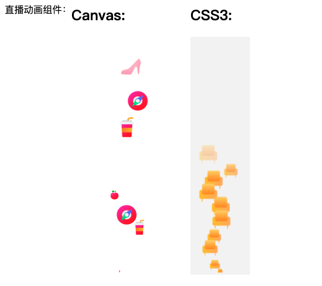

# canvas&css 实现直播动效
实现的是直播中点赞动画功能，目前已在作者负责的项目中上线。

### 代码使用
1、更改使用自己的图片，设置大小，动效路径等进行代码更改
2、canvas性能要比css动画要好

### 动画效果

原文地址：[教程地址](https://juejin.im/post/5e947b8f6fb9a03c957ffd1a)
[仓库地址](https://github.com/antiter/praise-animation/blob/master/index.html)
